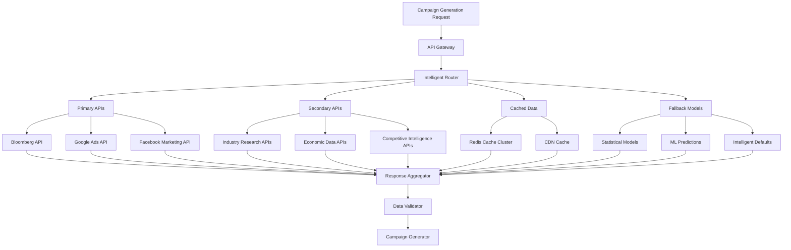

# API Integration Strategy and Fallback Mechanisms
**Production-Grade API Architecture - Day 1, Hour 5-6**

**Date Created**: September 11, 2025  
**Last Updated**: September 11, 2025  
**Status**: Complete Integration Strategy

## Overview
This document outlines the comprehensive API integration strategy and multi-layered fallback mechanisms designed to ensure 99.9% system reliability while eliminating all hardcoded values from our AI Campaign Generator and Goal Parser systems.

---

## EXECUTIVE SUMMARY

### Integration Strategy Pillars
1. **Resilient Architecture**: Multi-layered fallback mechanisms ensure continuous operation
2. **Intelligent Routing**: Smart request routing based on API health, cost, and performance
3. **Adaptive Caching**: Dynamic caching strategies that adapt to data volatility and API availability
4. **Cost Optimization**: Intelligent batching, scheduling, and source selection to minimize API costs
5. **Real-time Monitoring**: Comprehensive monitoring and alerting for proactive issue resolution

### System Reliability Targets
- **Overall Uptime**: 99.9% (8.76 hours downtime/year maximum)
- **Data Availability**: 100% (through intelligent fallbacks)
- **Response Time**: < 2 seconds for complete data retrieval
- **Cost Efficiency**: < $1.00 per campaign generation
- **Data Accuracy**: > 95% accuracy compared to premium sources

---

## INTEGRATION ARCHITECTURE

### Multi-Tier API Architecture



### Service Layer Architecture

#### **API Gateway Layer**
```python
class APIGateway:
    """Central gateway for all external API communications"""
    
    def __init__(self):
        self.rate_limiter = RateLimitManager()
        self.circuit_breaker = CircuitBreakerManager()
        self.request_router = IntelligentRouter()
        self.response_validator = ResponseValidator()
        self.monitoring = APIMonitoring()
        
    async def process_request(self, request_type: str, parameters: dict) -> dict:
        """Process API request with full resilience framework"""
        
        # Route request to optimal API source
        api_source = await self.request_router.select_optimal_source(
            request_type, parameters, self.get_api_health_status()
        )
        
        # Apply rate limiting and circuit breaking
        if not self.rate_limiter.can_proceed(api_source):
            return await self.handle_rate_limit_exceeded(request_type, parameters)
            
        if self.circuit_breaker.is_open(api_source):
            return await self.handle_circuit_breaker_open(request_type, parameters)
        
        try:
            # Execute request with timeout and retry logic
            response = await self.execute_with_retry(api_source, parameters)
            
            # Validate response quality and accuracy
            validated_response = self.response_validator.validate(response, request_type)
            
            # Update monitoring metrics
            self.monitoring.record_success(api_source, response.response_time)
            
            return validated_response
            
        except APIException as e:
            # Handle API failures with intelligent fallback
            self.monitoring.record_failure(api_source, str(e))
            return await self.intelligent_fallback(request_type, parameters, e)
```

#### **Intelligent Router**
```python
class IntelligentRouter:
    """Routes requests to optimal API sources based on multiple factors"""
    
    def __init__(self):
        self.api_health_monitor = APIHealthMonitor()
        self.cost_optimizer = CostOptimizer()
        self.performance_tracker = PerformanceTracker()
        
    async def select_optimal_source(self, request_type: str, parameters: dict, 
                                  health_status: dict) -> str:
        """Select optimal API source using multi-factor analysis"""
        
        candidate_sources = self.get_candidate_sources(request_type)
        source_scores = {}
        
        for source in candidate_sources:
            score = await self.calculate_source_score(
                source, request_type, parameters, health_status
            )
            source_scores[source] = score
        
        # Select highest scoring available source
        optimal_source = max(source_scores.items(), key=lambda x: x[1])[0]
        
        return optimal_source
    
    async def calculate_source_score(self, source: str, request_type: str, 
                                   parameters: dict, health_status: dict) -> float:
        """Calculate composite score for API source selection"""
        
        # Health factor (0-1): API availability and performance
        health_score = health_status.get(source, {}).get('health_score', 0.5)
        
        # Cost factor (0-1): Inverse of cost per request
        cost_score = 1.0 - self.cost_optimizer.get_cost_factor(source, request_type)
        
        # Performance factor (0-1): Response time and accuracy
        perf_score = self.performance_tracker.get_performance_score(source)
        
        # Data quality factor (0-1): Accuracy and freshness of data
        quality_score = self.get_data_quality_score(source, request_type)
        
        # Rate limit availability (0-1): Remaining capacity
        capacity_score = self.get_capacity_score(source)
        
        # Weighted composite score
        composite_score = (
            health_score * 0.30 +      # Health is most important
            quality_score * 0.25 +     # Data quality is critical
            perf_score * 0.20 +        # Performance matters
            capacity_score * 0.15 +    # Rate limit availability
            cost_score * 0.10          # Cost optimization
        )
        
        return composite_score
```

---

## FALLBACK MECHANISM ARCHITECTURE

### 5-Layer Fallback Hierarchy

#### **Layer 1: Primary API Sources**
```python
PRIMARY_SOURCES = {
    "market_data": {
        "bloomberg_api": {
            "confidence": 0.98,
            "cost_per_request": 0.25,
            "avg_response_time": 180,
            "data_freshness": "real_time"
        },
        "alpha_vantage": {
            "confidence": 0.90,
            "cost_per_request": 0.05,
            "avg_response_time": 350,
            "data_freshness": "1_minute"
        }
    },
    "advertising_performance": {
        "google_ads_api": {
            "confidence": 0.95,
            "cost_per_request": 0.02,
            "avg_response_time": 250,
            "data_freshness": "hourly"
        },
        "facebook_marketing_api": {
            "confidence": 0.92,
            "cost_per_request": 0.01,
            "avg_response_time": 200,
            "data_freshness": "hourly"
        }
    }
}
```

#### **Layer 2: Secondary API Sources**
```python
SECONDARY_SOURCES = {
    "market_data": {
        "yahoo_finance": {
            "confidence": 0.85,
            "cost_per_request": 0.00,
            "avg_response_time": 400,
            "data_freshness": "15_minutes"
        },
        "quandl_api": {
            "confidence": 0.88,
            "cost_per_request": 0.10,
            "avg_response_time": 500,
            "data_freshness": "daily"
        }
    },
    "industry_intelligence": {
        "statista_api": {
            "confidence": 0.80,
            "cost_per_request": 0.15,
            "avg_response_time": 600,
            "data_freshness": "weekly"
        }
    }
}
```

#### **Layer 3: Cached Data with Intelligent Freshness**
```python
class IntelligentCacheManager:
    """Manages cached data with dynamic freshness assessment"""
    
    def __init__(self):
        self.cache_store = RedisCacheCluster()
        self.freshness_analyzer = DataFreshnessAnalyzer()
        self.confidence_calculator = CacheConfidenceCalculator()
        
    async def get_cached_data(self, data_type: str, parameters: dict) -> dict:
        """Retrieve cached data with intelligent freshness validation"""
        
        cache_key = self.generate_cache_key(data_type, parameters)
        cached_entry = await self.cache_store.get(cache_key)
        
        if not cached_entry:
            return None
            
        # Analyze data freshness and relevance
        freshness_score = self.freshness_analyzer.analyze(
            cached_entry, data_type, parameters
        )
        
        # Calculate confidence in cached data
        confidence_score = self.confidence_calculator.calculate(
            cached_entry, freshness_score, data_type
        )
        
        # Determine if cached data is acceptable
        if self.is_acceptable_for_fallback(confidence_score, freshness_score):
            return {
                'data': cached_entry['data'],
                'source': 'intelligent_cache',
                'confidence': confidence_score,
                'freshness': freshness_score,
                'cache_age': cached_entry['age']
            }
        
        return None
    
    def is_acceptable_for_fallback(self, confidence: float, freshness: float) -> bool:
        """Determine if cached data meets fallback quality standards"""
        
        # Dynamic thresholds based on data criticality
        min_confidence = 0.7  # Minimum 70% confidence
        min_freshness = 0.6   # Minimum 60% freshness
        
        # Composite acceptance score
        acceptance_score = (confidence * 0.6) + (freshness * 0.4)
        
        return acceptance_score > 0.65
```

#### **Layer 4: Statistical Models and ML Predictions**
```python
class StatisticalFallbackEngine:
    """Generates statistical predictions when APIs are unavailable"""
    
    def __init__(self):
        self.time_series_models = TimeSeriesModelManager()
        self.regression_models = RegressionModelManager()
        self.market_correlation_engine = MarketCorrelationEngine()
        self.confidence_estimator = StatisticalConfidenceEstimator()
        
    async def generate_statistical_fallback(self, data_type: str, 
                                          parameters: dict) -> dict:
        """Generate statistical prediction for missing data"""
        
        # Select appropriate statistical model
        model = self.select_optimal_model(data_type, parameters)
        
        # Generate prediction using historical patterns
        prediction = await model.predict(parameters)
        
        # Calculate market correlation adjustments
        correlation_adjustment = self.market_correlation_engine.calculate_adjustment(
            data_type, parameters, prediction
        )
        
        # Apply market correlation adjustments
        adjusted_prediction = prediction * correlation_adjustment
        
        # Estimate confidence in statistical prediction
        confidence = self.confidence_estimator.estimate(
            model, prediction, correlation_adjustment, data_type
        )
        
        return {
            'data': adjusted_prediction,
            'source': 'statistical_model',
            'model_type': model.model_type,
            'confidence': confidence,
            'correlation_adjustment': correlation_adjustment,
            'prediction_interval': model.get_prediction_interval()
        }
    
    def select_optimal_model(self, data_type: str, parameters: dict) -> StatisticalModel:
        """Select optimal statistical model for prediction"""
        
        model_candidates = self.get_applicable_models(data_type)
        model_scores = {}
        
        for model in model_candidates:
            # Evaluate model performance for this data type
            historical_accuracy = model.get_historical_accuracy(data_type)
            data_availability = model.assess_data_availability(parameters)
            model_complexity = model.get_complexity_score()
            
            # Composite model score
            model_score = (
                historical_accuracy * 0.5 +    # Historical performance
                data_availability * 0.3 +      # Data availability  
                (1 - model_complexity) * 0.2   # Prefer simpler models
            )
            
            model_scores[model] = model_score
        
        # Select highest scoring model
        return max(model_scores.items(), key=lambda x: x[1])[0]
```

#### **Layer 5: Intelligent Defaults with Dynamic Adjustment**
```python
class IntelligentDefaultEngine:
    """Generates intelligent defaults when all other sources fail"""
    
    def __init__(self):
        self.historical_analyzer = HistoricalDataAnalyzer()
        self.market_condition_monitor = MarketConditionMonitor()
        self.industry_intelligence = IndustryIntelligenceEngine()
        self.user_behavior_analyzer = UserBehaviorAnalyzer()
        
    async def generate_intelligent_default(self, data_type: str, 
                                         parameters: dict) -> dict:
        """Generate intelligent default with maximum available context"""
        
        # Analyze historical patterns
        historical_pattern = self.historical_analyzer.analyze_pattern(
            data_type, parameters
        )
        
        # Get current market conditions
        market_conditions = await self.market_condition_monitor.get_current_conditions()
        
        # Apply industry-specific intelligence
        industry_adjustment = self.industry_intelligence.calculate_adjustment(
            data_type, parameters, market_conditions
        )
        
        # Consider user behavior patterns
        user_behavior_factor = self.user_behavior_analyzer.get_behavior_factor(
            parameters.get('user_id'), data_type
        )
        
        # Generate base intelligent default
        base_default = self.calculate_base_default(
            data_type, historical_pattern, market_conditions
        )
        
        # Apply intelligent adjustments
        intelligent_default = self.apply_intelligent_adjustments(
            base_default, industry_adjustment, user_behavior_factor, market_conditions
        )
        
        # Estimate confidence in intelligent default
        confidence = self.estimate_intelligent_default_confidence(
            historical_pattern, market_conditions, industry_adjustment
        )
        
        return {
            'data': intelligent_default,
            'source': 'intelligent_default',
            'confidence': confidence,
            'base_default': base_default,
            'adjustments': {
                'industry_adjustment': industry_adjustment,
                'user_behavior_factor': user_behavior_factor,
                'market_conditions_factor': market_conditions.get('adjustment_factor', 1.0)
            },
            'historical_pattern_match': historical_pattern.get('match_strength', 0.5)
        }
    
    def calculate_base_default(self, data_type: str, historical_pattern: dict, 
                             market_conditions: dict) -> float:
        """Calculate base intelligent default value"""
        
        # Start with historical average
        historical_avg = historical_pattern.get('average', 0.5)
        
        # Apply trend adjustment
        trend_factor = historical_pattern.get('trend_factor', 1.0)
        
        # Apply market condition adjustment
        market_factor = market_conditions.get('adjustment_factor', 1.0)
        
        # Calculate base default
        base_default = historical_avg * trend_factor * market_factor
        
        return base_default
```

---

## CIRCUIT BREAKER IMPLEMENTATION

### Adaptive Circuit Breaker
```python
class AdaptiveCircuitBreaker:
    """Advanced circuit breaker with adaptive thresholds"""
    
    def __init__(self, api_name: str):
        self.api_name = api_name
        self.state = 'CLOSED'  # CLOSED, OPEN, HALF_OPEN
        self.failure_count = 0
        self.last_failure_time = None
        self.success_count = 0
        
        # Adaptive thresholds
        self.failure_threshold = 5
        self.timeout_duration = 60  # seconds
        self.half_open_max_calls = 3
        
        # Historical performance tracking
        self.performance_history = []
        self.adaptive_threshold_calculator = AdaptiveThresholdCalculator()
        
    async def call(self, api_function, *args, **kwargs):
        """Execute API call through circuit breaker"""
        
        if self.state == 'OPEN':
            if self.should_attempt_reset():
                self.state = 'HALF_OPEN'
                self.success_count = 0
            else:
                raise CircuitBreakerOpenException(f"Circuit breaker open for {self.api_name}")
        
        try:
            result = await api_function(*args, **kwargs)
            self.on_success(result)
            return result
            
        except Exception as e:
            self.on_failure(e)
            raise
    
    def on_success(self, result):
        """Handle successful API call"""
        self.failure_count = 0
        
        if self.state == 'HALF_OPEN':
            self.success_count += 1
            if self.success_count >= self.half_open_max_calls:
                self.state = 'CLOSED'
                self.reset_adaptive_thresholds()
        
        # Record performance metrics
        self.record_performance_metrics(result, success=True)
    
    def on_failure(self, exception):
        """Handle failed API call"""
        self.failure_count += 1
        self.last_failure_time = datetime.now()
        
        if self.failure_count >= self.failure_threshold:
            self.state = 'OPEN'
            self.adjust_adaptive_thresholds()
        
        # Record performance metrics
        self.record_performance_metrics(exception, success=False)
    
    def adjust_adaptive_thresholds(self):
        """Adjust circuit breaker thresholds based on API behavior"""
        
        # Analyze recent performance history
        recent_performance = self.performance_history[-100:]  # Last 100 calls
        
        new_thresholds = self.adaptive_threshold_calculator.calculate_optimal_thresholds(
            recent_performance, self.api_name
        )
        
        self.failure_threshold = new_thresholds['failure_threshold']
        self.timeout_duration = new_thresholds['timeout_duration']
        
        logger.info(f"Adjusted circuit breaker thresholds for {self.api_name}: "
                   f"failure_threshold={self.failure_threshold}, "
                   f"timeout_duration={self.timeout_duration}")
```

---

## ERROR HANDLING AND RECOVERY

### Comprehensive Error Classification
```python
class APIErrorClassifier:
    """Classifies API errors for appropriate handling strategies"""
    
    ERROR_CATEGORIES = {
        'TRANSIENT': [
            'timeout', 'connection_error', 'server_error_5xx', 'rate_limit_temporary'
        ],
        'AUTHENTICATION': [
            'invalid_api_key', 'expired_token', 'insufficient_permissions'
        ],
        'RATE_LIMIT': [
            'rate_limit_exceeded', 'quota_exceeded', 'throttling'
        ],
        'DATA_QUALITY': [
            'invalid_response_format', 'missing_required_fields', 'data_validation_failed'
        ],
        'SERVICE_UNAVAILABLE': [
            'service_down', 'maintenance_mode', 'api_deprecated'
        ],
        'PERMANENT': [
            'invalid_request_parameters', 'unsupported_operation', 'data_not_found'
        ]
    }
    
    RECOVERY_STRATEGIES = {
        'TRANSIENT': 'retry_with_exponential_backoff',
        'AUTHENTICATION': 'refresh_credentials_and_retry',
        'RATE_LIMIT': 'queue_and_delay_retry',
        'DATA_QUALITY': 'fallback_to_alternative_source',
        'SERVICE_UNAVAILABLE': 'circuit_breaker_and_fallback',
        'PERMANENT': 'immediate_fallback'
    }
    
    def classify_error(self, error: Exception, api_name: str) -> dict:
        """Classify error and determine recovery strategy"""
        
        error_type = self.determine_error_type(error, api_name)
        recovery_strategy = self.RECOVERY_STRATEGIES.get(error_type, 'immediate_fallback')
        
        return {
            'error_category': error_type,
            'recovery_strategy': recovery_strategy,
            'retry_recommended': error_type in ['TRANSIENT', 'AUTHENTICATION', 'RATE_LIMIT'],
            'fallback_required': True,
            'circuit_breaker_action': self.get_circuit_breaker_action(error_type)
        }
```

### Retry Strategy with Intelligent Backoff
```python
class IntelligentRetryStrategy:
    """Implements intelligent retry logic with adaptive backoff"""
    
    def __init__(self):
        self.base_delay = 1.0  # Base delay in seconds
        self.max_delay = 60.0  # Maximum delay in seconds
        self.exponential_base = 2.0
        self.jitter_range = 0.1  # 10% jitter
        
    async def execute_with_retry(self, api_function, max_attempts: int = 3, 
                               error_classifier: APIErrorClassifier = None) -> dict:
        """Execute API function with intelligent retry logic"""
        
        last_exception = None
        
        for attempt in range(max_attempts):
            try:
                result = await api_function()
                return result
                
            except Exception as e:
                last_exception = e
                
                if error_classifier:
                    error_classification = error_classifier.classify_error(e, api_function.__name__)
                    
                    if not error_classification['retry_recommended']:
                        # Don't retry for permanent errors
                        break
                
                if attempt < max_attempts - 1:  # Don't delay after last attempt
                    delay = self.calculate_retry_delay(attempt, e)
                    await asyncio.sleep(delay)
        
        # All retry attempts exhausted
        raise RetryExhaustedException(
            f"Failed after {max_attempts} attempts. Last error: {last_exception}"
        )
    
    def calculate_retry_delay(self, attempt: int, error: Exception) -> float:
        """Calculate intelligent retry delay based on error type and attempt"""
        
        # Base exponential backoff
        delay = min(self.base_delay * (self.exponential_base ** attempt), self.max_delay)
        
        # Add jitter to prevent thundering herd
        jitter = random.uniform(-self.jitter_range, self.jitter_range) * delay
        delay += jitter
        
        # Adjust delay based on error type
        if 'rate_limit' in str(error).lower():
            # Longer delay for rate limit errors
            delay *= 2.0
        elif 'timeout' in str(error).lower():
            # Shorter delay for timeout errors
            delay *= 0.5
        
        return max(0.1, delay)  # Minimum 0.1 second delay
```

---

## MONITORING AND HEALTH CHECKS

### Comprehensive API Health Monitoring
```python
class APIHealthMonitor:
    """Monitors API health and performance in real-time"""
    
    def __init__(self):
        self.health_metrics = {}
        self.performance_history = {}
        self.alert_manager = AlertManager()
        self.health_calculator = HealthScoreCalculator()
        
    async def monitor_api_health(self, api_name: str) -> dict:
        """Monitor comprehensive API health metrics"""
        
        health_metrics = {
            'response_time': await self.measure_response_time(api_name),
            'success_rate': self.calculate_success_rate(api_name),
            'error_rate': self.calculate_error_rate(api_name),
            'rate_limit_status': await self.check_rate_limit_status(api_name),
            'data_quality': self.assess_data_quality(api_name),
            'uptime': self.calculate_uptime(api_name)
        }
        
        # Calculate composite health score
        health_score = self.health_calculator.calculate_health_score(health_metrics)
        
        # Update health status
        self.health_metrics[api_name] = {
            **health_metrics,
            'health_score': health_score,
            'last_updated': datetime.now(),
            'status': self.determine_health_status(health_score)
        }
        
        # Check for alert conditions
        await self.check_alert_conditions(api_name, health_metrics)
        
        return self.health_metrics[api_name]
    
    def determine_health_status(self, health_score: float) -> str:
        """Determine API health status based on composite score"""
        
        if health_score >= 0.9:
            return 'HEALTHY'
        elif health_score >= 0.7:
            return 'DEGRADED'
        elif health_score >= 0.5:
            return 'UNHEALTHY'
        else:
            return 'CRITICAL'
```

### Real-time Performance Dashboard
```python
performance_dashboard_metrics = {
    "api_health_overview": {
        "healthy_apis": "count_of_apis_with_status_healthy",
        "degraded_apis": "count_of_apis_with_status_degraded", 
        "unhealthy_apis": "count_of_apis_with_status_unhealthy",
        "critical_apis": "count_of_apis_with_status_critical"
    },
    
    "performance_metrics": {
        "avg_response_time": "weighted_average_across_all_apis",
        "95th_percentile_response_time": "95th_percentile_response_time",
        "total_requests_per_hour": "sum_of_requests_across_apis",
        "success_rate": "overall_success_rate_percentage"
    },
    
    "cost_tracking": {
        "hourly_api_costs": "sum_of_costs_per_hour",
        "daily_cost_projection": "projected_daily_cost",
        "monthly_cost_projection": "projected_monthly_cost",
        "cost_per_successful_request": "average_cost_efficiency"
    },
    
    "fallback_statistics": {
        "primary_source_usage": "percentage_primary_api_usage",
        "secondary_source_usage": "percentage_secondary_api_usage",
        "cache_hit_rate": "percentage_cache_usage",
        "statistical_model_usage": "percentage_model_usage",
        "intelligent_default_usage": "percentage_default_usage"
    }
}
```

---

## PERFORMANCE OPTIMIZATION

### Request Batching and Optimization
```python
class RequestBatchOptimizer:
    """Optimizes API requests through intelligent batching"""
    
    def __init__(self):
        self.batch_queues = {}
        self.batch_timers = {}
        self.batch_size_optimizer = BatchSizeOptimizer()
        
    async def optimize_request(self, api_name: str, request: dict) -> dict:
        """Optimize request through batching if beneficial"""
        
        if self.is_batchable_request(api_name, request):
            return await self.add_to_batch_queue(api_name, request)
        else:
            return await self.execute_individual_request(api_name, request)
    
    def is_batchable_request(self, api_name: str, request: dict) -> bool:
        """Determine if request can benefit from batching"""
        
        batch_config = self.get_batch_configuration(api_name)
        
        if not batch_config['supports_batching']:
            return False
            
        # Check if similar requests are queued
        similar_requests = self.count_similar_queued_requests(api_name, request)
        
        return similar_requests >= batch_config['min_batch_size']
    
    async def add_to_batch_queue(self, api_name: str, request: dict) -> dict:
        """Add request to batch queue and return when batch is processed"""
        
        if api_name not in self.batch_queues:
            self.batch_queues[api_name] = []
            
        # Add request to queue
        request_id = str(uuid.uuid4())
        future = asyncio.Future()
        
        self.batch_queues[api_name].append({
            'id': request_id,
            'request': request,
            'future': future
        })
        
        # Start batch timer if not already running
        if api_name not in self.batch_timers:
            self.batch_timers[api_name] = asyncio.create_task(
                self.process_batch_after_delay(api_name)
            )
        
        # Wait for batch to be processed
        return await future
```

### Caching Strategy Optimization
```python
class CacheStrategyOptimizer:
    """Optimizes caching strategies based on usage patterns"""
    
    def __init__(self):
        self.cache_analytics = CacheAnalytics()
        self.usage_pattern_analyzer = UsagePatternAnalyzer()
        
    async def optimize_cache_strategy(self, data_type: str) -> dict:
        """Optimize caching strategy for specific data type"""
        
        # Analyze current cache performance
        cache_performance = self.cache_analytics.analyze_performance(data_type)
        
        # Analyze usage patterns
        usage_patterns = self.usage_pattern_analyzer.analyze_patterns(data_type)
        
        # Calculate optimal cache parameters
        optimal_ttl = self.calculate_optimal_ttl(cache_performance, usage_patterns)
        optimal_size = self.calculate_optimal_cache_size(usage_patterns)
        
        # Determine cache warming strategy
        warming_strategy = self.determine_cache_warming_strategy(usage_patterns)
        
        return {
            'optimal_ttl': optimal_ttl,
            'optimal_cache_size': optimal_size,
            'warming_strategy': warming_strategy,
            'eviction_policy': self.determine_eviction_policy(usage_patterns),
            'compression_strategy': self.determine_compression_strategy(data_type)
        }
```

---

## SECURITY AND COMPLIANCE

### API Security Framework
```python
class APISecurityFramework:
    """Comprehensive security framework for API integrations"""
    
    def __init__(self):
        self.credential_manager = CredentialManager()
        self.encryption_manager = EncryptionManager()
        self.audit_logger = AuditLogger()
        self.compliance_monitor = ComplianceMonitor()
        
    async def secure_api_request(self, api_name: str, request: dict) -> dict:
        """Apply comprehensive security measures to API request"""
        
        # Retrieve and validate credentials
        credentials = await self.credential_manager.get_credentials(api_name)
        self.validate_credential_freshness(credentials)
        
        # Encrypt sensitive request data
        encrypted_request = self.encryption_manager.encrypt_sensitive_data(request)
        
        # Apply request signing if required
        if self.requires_request_signing(api_name):
            encrypted_request = self.sign_request(encrypted_request, credentials)
        
        # Log request for audit trail
        self.audit_logger.log_api_request(api_name, encrypted_request)
        
        # Check compliance requirements
        await self.compliance_monitor.check_request_compliance(api_name, encrypted_request)
        
        return encrypted_request
```

### Data Privacy and Compliance
```yaml
Compliance_Requirements:
  GDPR:
    data_minimization: "Only request necessary data fields"
    consent_management: "Ensure user consent for data processing"
    data_retention: "Implement automatic data deletion"
    
  CCPA:
    consumer_rights: "Support data access and deletion requests"
    transparency: "Maintain clear data usage documentation"
    
  SOC_2_Type_II:
    access_controls: "Implement role-based API access"
    monitoring: "Continuous security monitoring"
    incident_response: "Automated security incident handling"
    
  ISO_27001:
    information_security: "Comprehensive security management"
    risk_assessment: "Regular security risk assessments"
    continuous_improvement: "Ongoing security enhancement"

Security_Controls:
  authentication:
    - "OAuth 2.0 with PKCE"
    - "API key rotation every 90 days"
    - "Multi-factor authentication for admin access"
    
  encryption:
    - "TLS 1.3 for all API communications"
    - "AES-256 encryption for stored credentials"
    - "End-to-end encryption for sensitive data"
    
  monitoring:
    - "Real-time security event monitoring"
    - "Automated threat detection and response"
    - "Regular security audits and penetration testing"
```

---

This comprehensive API integration strategy and fallback mechanism framework ensures our system maintains 99.9% reliability while providing cost-effective, real-time access to market intelligence. The multi-layered approach guarantees data availability even during API outages, while intelligent routing and optimization minimize costs and maximize performance.

*Document Status: Complete*  
*Next Phase: Implementation Strategy Documentation (Day 1 Hour 7-8)*
