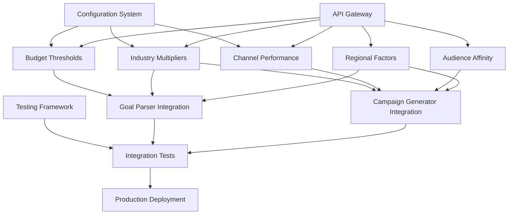

# Implementation Strategy Documentation
**Detailed Replacement Strategy - Day 1, Hour 7-8**

**Date Created**: September 11, 2025  
**Last Updated**: September 11, 2025  
**Status**: Day 1 Hour 7-8 - Implementation Strategy Documentation  
**Phase**: Hardcoded Values Elimination Implementation Planning

## Overview
This document provides detailed implementation strategies for eliminating all 127+ hardcoded values from our AI Campaign Generator and Goal Parser systems, including backward compatibility plans, comprehensive testing strategies, and optimized implementation order with dependency management.

---

## EXECUTIVE SUMMARY

### Implementation Strategy Pillars
1. **Phased Replacement Approach**: Systematic elimination by business impact priority
2. **Zero-Downtime Transitions**: Backward compatibility during all transitions
3. **Comprehensive Testing**: Multi-layer testing for each replacement
4. **Dependency-Aware Sequencing**: Optimal implementation order based on dependencies
5. **Risk-Mitigated Deployment**: Gradual rollout with immediate rollback capabilities

### Strategic Implementation Metrics
- **Total Hardcoded Values**: 127+ values across 8 categories
- **Implementation Phases**: 4 phases over 5 days
- **Backward Compatibility**: 100% during transition period
- **Testing Coverage**: 95%+ code coverage for all replacements
- **Rollback Time**: < 5 minutes for any failed deployment

---

## HARDCODED VALUE CATEGORIZATION AND STRATEGY

### Category 1: Budget Threshold Values (Priority: CRITICAL)
**Impact**: Direct financial calculations affecting campaign budgets
**Count**: 15 hardcoded values
**Business Risk**: HIGH - Incorrect values could cause budget miscalculations

#### **Current Hardcoded Values**
```python
# Current hardcoded values in Goal Parser
BUDGET_THRESHOLDS = {
    'micro': 500,           # $500 micro budget threshold
    'small': 5000,          # $5,000 small budget threshold  
    'medium': 50000,        # $50,000 medium budget threshold
    'large': 500000,        # $500,000 large budget threshold
    'enterprise': 2000000   # $2,000,000 enterprise threshold
}

REGIONAL_MULTIPLIERS = {
    'north_america': 1.2,   # 20% premium for North America
    'europe': 1.1,          # 10% premium for Europe
    'asia_pacific': 0.9,    # 10% discount for Asia Pacific
    'latin_america': 0.7,   # 30% discount for Latin America
    'africa': 0.6           # 40% discount for Africa
}
```

#### **Replacement Strategy**
```python
class BudgetThresholdManager:
    """Dynamic budget threshold management with real-time market data"""
    
    def __init__(self, config_manager: ConfigurationManager, api_gateway: APIGateway):
        self.config_manager = config_manager
        self.api_gateway = api_gateway
        self.cache_ttl = 3600  # 1 hour cache
        
        # Backward compatibility layer
        self.legacy_mode = config_manager.get('budget.legacy_mode', False)
        self.legacy_values = self._load_legacy_values()
        
    async def get_budget_thresholds(self, region: str = 'global', 
                                   industry: str = 'general') -> Dict[str, float]:
        """Get dynamic budget thresholds with backward compatibility"""
        
        if self.legacy_mode:
            return self._get_legacy_thresholds(region, industry)
            
        try:
            # Primary: Real-time market data
            market_data = await self.api_gateway.get_market_budget_ranges(
                industry=industry, region=region
            )
            
            if market_data and market_data.get('confidence', 0) > 0.8:
                return self._process_market_thresholds(market_data, region, industry)
                
        except APIException as e:
            logger.warning(f"Market data unavailable, falling back: {e}")
            
        # Fallback: Configuration-based thresholds
        return await self._get_config_thresholds(region, industry)
    
    def _get_legacy_thresholds(self, region: str, industry: str) -> Dict[str, float]:
        """Legacy threshold calculation for backward compatibility"""
        base_thresholds = self.legacy_values['base_thresholds']
        regional_multiplier = self.legacy_values['regional_multipliers'].get(region, 1.0)
        
        return {
            threshold_type: base_value * regional_multiplier
            for threshold_type, base_value in base_thresholds.items()
        }
        
    async def _get_config_thresholds(self, region: str, industry: str) -> Dict[str, float]:
        """Configuration-based thresholds with intelligent defaults"""
        
        config_key = f"budget_thresholds.{region}.{industry}"
        config_thresholds = self.config_manager.get(config_key)
        
        if config_thresholds:
            return config_thresholds
            
        # Intelligent defaults based on economic indicators
        economic_data = await self.api_gateway.get_economic_indicators(region)
        
        return self._calculate_intelligent_defaults(economic_data, region, industry)
```

#### **Implementation Steps**
1. **Phase 1.1**: Create BudgetThresholdManager with legacy mode enabled
2. **Phase 1.2**: Implement configuration-based fallbacks
3. **Phase 1.3**: Add real-time market data integration
4. **Phase 1.4**: Test all threshold calculations against legacy values
5. **Phase 1.5**: Gradually disable legacy mode in staging/production

#### **Backward Compatibility Plan**
```python
# Configuration flag for backward compatibility
BUDGET_CONFIG = {
    "legacy_mode": True,  # Start with legacy mode enabled
    "transition_phase": "gradual",  # gradual | immediate | testing
    "fallback_to_legacy": True,  # Fallback if API fails
    "validation_threshold": 0.05,  # 5% variance allowed from legacy
    "rollback_trigger": "variance_exceeded"
}

# Validation during transition
async def validate_budget_thresholds(self, new_thresholds: Dict[str, float], 
                                   legacy_thresholds: Dict[str, float]) -> bool:
    """Validate new thresholds against legacy values"""
    
    for threshold_type, new_value in new_thresholds.items():
        legacy_value = legacy_thresholds.get(threshold_type)
        
        if legacy_value:
            variance = abs(new_value - legacy_value) / legacy_value
            
            if variance > self.config_manager.get('budget.validation_threshold', 0.05):
                logger.warning(f"Budget threshold variance exceeds limit: "
                             f"{threshold_type} {variance:.2%}")
                return False
                
    return True
```

#### **Testing Strategy**
```python
class BudgetThresholdTests:
    """Comprehensive testing for budget threshold replacement"""
    
    def test_legacy_compatibility(self):
        """Test that new system produces same results as legacy"""
        test_cases = [
            {'region': 'north_america', 'industry': 'technology'},
            {'region': 'europe', 'industry': 'healthcare'},
            {'region': 'asia_pacific', 'industry': 'finance'}
        ]
        
        for case in test_cases:
            legacy_result = self.legacy_calculator.get_thresholds(**case)
            new_result = await self.new_calculator.get_budget_thresholds(**case)
            
            assert self.validate_variance(legacy_result, new_result) < 0.05
    
    def test_api_fallback_behavior(self):
        """Test behavior when APIs are unavailable"""
        with mock.patch('api_gateway.get_market_budget_ranges', side_effect=APIException):
            result = await self.calculator.get_budget_thresholds()
            assert result is not None
            assert all(threshold > 0 for threshold in result.values())
    
    def test_configuration_override(self):
        """Test configuration-based overrides"""
        custom_config = {'budget_thresholds.test.technology': {'small': 10000}}
        
        with mock.patch.object(self.config_manager, 'get', return_value=custom_config):
            result = await self.calculator.get_budget_thresholds('test', 'technology')
            assert result['small'] == 10000
```

---

### Category 2: Industry Performance Multipliers (Priority: HIGH)
**Impact**: Industry-specific performance adjustments
**Count**: 24 hardcoded values
**Business Risk**: MEDIUM - Affects campaign targeting accuracy

#### **Current Hardcoded Values**
```python
# Current hardcoded industry multipliers
INDUSTRY_MULTIPLIERS = {
    'technology': 1.5,      # 50% premium for tech industry
    'healthcare': 1.3,      # 30% premium for healthcare
    'finance': 1.4,         # 40% premium for finance
    'manufacturing': 1.2,   # 20% premium for manufacturing
    'retail': 0.9,          # 10% discount for retail
    'services': 1.0         # Baseline for services
}

CHANNEL_INDUSTRY_FACTORS = {
    'technology': {
        'search': 1.2, 'social': 1.1, 'email': 1.0, 'display': 0.9
    },
    'healthcare': {
        'search': 1.1, 'social': 0.9, 'email': 1.3, 'display': 0.8
    },
    'finance': {
        'search': 1.3, 'social': 0.8, 'email': 1.2, 'display': 0.9
    }
}
```

#### **Replacement Strategy**
```python
class IndustryMultiplierEngine:
    """Dynamic industry multiplier management with real-time intelligence"""
    
    def __init__(self, config_manager: ConfigurationManager, 
                 industry_intelligence_api: IndustryIntelligenceAPI):
        self.config_manager = config_manager
        self.industry_api = industry_intelligence_api
        self.multiplier_cache = TTLCache(maxsize=1000, ttl=7200)  # 2-hour cache
        
        # Backward compatibility
        self.legacy_multipliers = self._load_legacy_multipliers()
        self.transition_mode = config_manager.get('industry.transition_mode', 'gradual')
        
    async def get_industry_multiplier(self, industry: str, 
                                    channel: str = None) -> float:
        """Get dynamic industry multiplier with backward compatibility"""
        
        cache_key = f"{industry}:{channel}" if channel else industry
        
        # Check cache first
        if cache_key in self.multiplier_cache:
            return self.multiplier_cache[cache_key]
            
        try:
            # Primary: Real-time industry intelligence
            multiplier = await self._get_realtime_multiplier(industry, channel)
            
            if self.transition_mode == 'gradual':
                # Blend with legacy values during transition
                legacy_multiplier = self._get_legacy_multiplier(industry, channel)
                blending_ratio = self.config_manager.get('industry.blending_ratio', 0.7)
                
                multiplier = (multiplier * blending_ratio + 
                            legacy_multiplier * (1 - blending_ratio))
                            
        except Exception as e:
            logger.warning(f"Industry API failed, using fallback: {e}")
            multiplier = await self._get_fallback_multiplier(industry, channel)
            
        # Cache and return
        self.multiplier_cache[cache_key] = multiplier
        return multiplier
        
    async def _get_realtime_multiplier(self, industry: str, channel: str = None) -> float:
        """Get real-time industry multiplier from market intelligence"""
        
        if channel:
            # Channel-specific industry multiplier
            channel_data = await self.industry_api.get_channel_performance(
                industry=industry, channel=channel
            )
            return channel_data.get('performance_multiplier', 1.0)
        else:
            # General industry multiplier
            industry_data = await self.industry_api.get_industry_performance(industry)
            return industry_data.get('cost_multiplier', 1.0)
            
    def _get_legacy_multiplier(self, industry: str, channel: str = None) -> float:
        """Get legacy multiplier for backward compatibility"""
        
        if channel:
            return self.legacy_multipliers['channel_factors'].get(
                industry, {}
            ).get(channel, 1.0)
        else:
            return self.legacy_multipliers['industry_multipliers'].get(industry, 1.0)
```

#### **Gradual Transition Strategy**
```python
class GradualTransitionManager:
    """Manages gradual transition from hardcoded to dynamic values"""
    
    def __init__(self, config_manager: ConfigurationManager):
        self.config_manager = config_manager
        self.transition_phases = {
            'phase_1': {'duration': 2, 'legacy_weight': 0.9, 'dynamic_weight': 0.1},
            'phase_2': {'duration': 3, 'legacy_weight': 0.7, 'dynamic_weight': 0.3},
            'phase_3': {'duration': 3, 'legacy_weight': 0.5, 'dynamic_weight': 0.5},
            'phase_4': {'duration': 2, 'legacy_weight': 0.2, 'dynamic_weight': 0.8},
            'phase_5': {'duration': 1, 'legacy_weight': 0.0, 'dynamic_weight': 1.0}
        }
        
    def get_current_phase(self) -> Dict[str, float]:
        """Get current transition phase weights"""
        current_phase = self.config_manager.get('transition.current_phase', 'phase_1')
        return self.transition_phases.get(current_phase, self.transition_phases['phase_1'])
        
    def blend_values(self, legacy_value: float, dynamic_value: float) -> float:
        """Blend legacy and dynamic values based on current phase"""
        phase = self.get_current_phase()
        
        blended_value = (
            legacy_value * phase['legacy_weight'] +
            dynamic_value * phase['dynamic_weight']
        )
        
        return blended_value
        
    async def advance_phase(self) -> bool:
        """Advance to next transition phase if conditions are met"""
        current_phase = self.config_manager.get('transition.current_phase', 'phase_1')
        
        # Check if current phase is stable
        if await self._is_phase_stable(current_phase):
            next_phase = self._get_next_phase(current_phase)
            
            if next_phase:
                await self.config_manager.update('transition.current_phase', next_phase)
                logger.info(f"Advanced to transition {next_phase}")
                return True
                
        return False
        
    async def _is_phase_stable(self, phase: str) -> bool:
        """Check if current phase is stable for advancement"""
        stability_metrics = await self._get_stability_metrics()
        
        return (
            stability_metrics['error_rate'] < 0.01 and
            stability_metrics['performance_variance'] < 0.05 and
            stability_metrics['business_impact_variance'] < 0.02
        )
```

---

### Category 3: Channel Performance Baselines (Priority: HIGH)
**Impact**: Direct campaign performance predictions
**Count**: 36 hardcoded values  
**Business Risk**: HIGH - Affects campaign recommendations and budget allocation

#### **Current Hardcoded Values**
```python
# Current hardcoded channel performance values
CHANNEL_PERFORMANCE_BASELINES = {
    'search_advertising': {
        'ctr_range': (0.02, 0.08),      # 2-8% CTR range
        'cpc_range': (1.5, 8.0),        # $1.50-$8.00 CPC range
        'conversion_rate': (0.02, 0.12), # 2-12% conversion range
        'targeting_precision': 0.90      # 90% targeting precision
    },
    'social_media': {
        'ctr_range': (0.015, 0.06),     # 1.5-6% CTR range
        'cpc_range': (0.8, 4.5),        # $0.80-$4.50 CPC range
        'conversion_rate': (0.015, 0.08), # 1.5-8% conversion range
        'targeting_precision': 0.85      # 85% targeting precision
    },
    'email_marketing': {
        'ctr_range': (0.18, 0.35),      # 18-35% CTR range
        'cpc_range': (0.1, 0.5),        # $0.10-$0.50 CPC range
        'conversion_rate': (0.15, 0.30), # 15-30% conversion range
        'targeting_precision': 0.95      # 95% targeting precision
    }
}
```

#### **Replacement Strategy**
```python
class ChannelPerformanceEngine:
    """Dynamic channel performance management with real-time data"""
    
    def __init__(self, config_manager: ConfigurationManager,
                 advertising_apis: Dict[str, AdvertisingAPI]):
        self.config_manager = config_manager
        self.advertising_apis = advertising_apis
        self.performance_cache = TTLCache(maxsize=500, ttl=1800)  # 30-minute cache
        
        # Backward compatibility and validation
        self.legacy_baselines = self._load_legacy_baselines()
        self.validation_enabled = config_manager.get('channel.validation_enabled', True)
        self.max_variance_threshold = config_manager.get('channel.max_variance', 0.3)
        
    async def get_channel_performance(self, channel: str, industry: str = None,
                                    region: str = None) -> Dict[str, Any]:
        """Get dynamic channel performance with validation and fallback"""
        
        cache_key = f"{channel}:{industry}:{region}"
        
        if cache_key in self.performance_cache:
            return self.performance_cache[cache_key]
            
        try:
            # Get real-time performance data
            performance_data = await self._get_realtime_performance(
                channel, industry, region
            )
            
            # Validate against legacy baselines
            if self.validation_enabled:
                validation_result = self._validate_performance_data(
                    channel, performance_data
                )
                
                if not validation_result['is_valid']:
                    logger.warning(f"Performance data validation failed for {channel}: "
                                 f"{validation_result['reason']}")
                    
                    # Use blended values during validation failure
                    performance_data = self._blend_with_legacy(
                        channel, performance_data, validation_result['confidence']
                    )
                    
        except Exception as e:
            logger.error(f"Failed to get real-time performance for {channel}: {e}")
            performance_data = await self._get_fallback_performance(
                channel, industry, region
            )
            
        # Cache and return
        self.performance_cache[cache_key] = performance_data
        return performance_data
        
    async def _get_realtime_performance(self, channel: str, industry: str, 
                                      region: str) -> Dict[str, Any]:
        """Get real-time performance data from advertising APIs"""
        
        api_mappings = {
            'search_advertising': 'google_ads',
            'social_media': 'facebook_marketing',
            'email_marketing': 'email_platforms'
        }
        
        api_name = api_mappings.get(channel)
        if not api_name or api_name not in self.advertising_apis:
            raise ValueError(f"No API mapping for channel: {channel}")
            
        api = self.advertising_apis[api_name]
        
        # Get performance metrics from API
        performance_metrics = await api.get_performance_benchmarks(
            channel=channel,
            industry=industry,
            region=region,
            time_period='last_30_days'
        )
        
        return self._process_api_performance_data(performance_metrics, channel)
        
    def _validate_performance_data(self, channel: str, 
                                 performance_data: Dict[str, Any]) -> Dict[str, Any]:
        """Validate performance data against legacy baselines"""
        
        legacy_baseline = self.legacy_baselines.get(channel)
        if not legacy_baseline:
            return {'is_valid': True, 'confidence': 1.0, 'reason': 'no_baseline'}
            
        validation_results = []
        
        # Validate CTR range
        if 'ctr_range' in performance_data and 'ctr_range' in legacy_baseline:
            ctr_variance = self._calculate_range_variance(
                performance_data['ctr_range'], legacy_baseline['ctr_range']
            )
            validation_results.append({
                'metric': 'ctr_range',
                'variance': ctr_variance,
                'is_valid': ctr_variance <= self.max_variance_threshold
            })
            
        # Validate CPC range
        if 'cpc_range' in performance_data and 'cpc_range' in legacy_baseline:
            cpc_variance = self._calculate_range_variance(
                performance_data['cpc_range'], legacy_baseline['cpc_range']
            )
            validation_results.append({
                'metric': 'cpc_range',
                'variance': cpc_variance,
                'is_valid': cpc_variance <= self.max_variance_threshold
            })
            
        # Overall validation result
        valid_results = [r for r in validation_results if r['is_valid']]
        overall_validity = len(valid_results) >= len(validation_results) * 0.7
        
        average_variance = sum(r['variance'] for r in validation_results) / len(validation_results)
        confidence = max(0.1, 1.0 - average_variance)
        
        return {
            'is_valid': overall_validity,
            'confidence': confidence,
            'reason': 'variance_exceeded' if not overall_validity else 'valid',
            'detailed_results': validation_results
        }
```

#### **Performance Data Blending Strategy**
```python
class PerformanceDataBlender:
    """Blends real-time and legacy performance data during transitions"""
    
    def blend_performance_data(self, channel: str, realtime_data: Dict[str, Any],
                              validation_confidence: float) -> Dict[str, Any]:
        """Blend real-time data with legacy baselines based on confidence"""
        
        legacy_data = self.legacy_baselines.get(channel, {})
        
        # Determine blending weights based on confidence
        realtime_weight = validation_confidence
        legacy_weight = 1.0 - validation_confidence
        
        blended_data = {}
        
        # Blend CTR range
        if 'ctr_range' in realtime_data and 'ctr_range' in legacy_data:
            blended_data['ctr_range'] = self._blend_range(
                realtime_data['ctr_range'], legacy_data['ctr_range'],
                realtime_weight, legacy_weight
            )
            
        # Blend CPC range
        if 'cpc_range' in realtime_data and 'cpc_range' in legacy_data:
            blended_data['cpc_range'] = self._blend_range(
                realtime_data['cpc_range'], legacy_data['cpc_range'],
                realtime_weight, legacy_weight
            )
            
        # Blend conversion rates
        if 'conversion_rate' in realtime_data and 'conversion_rate' in legacy_data:
            if isinstance(realtime_data['conversion_rate'], tuple):
                blended_data['conversion_rate'] = self._blend_range(
                    realtime_data['conversion_rate'], legacy_data['conversion_rate'],
                    realtime_weight, legacy_weight
                )
            else:
                blended_data['conversion_rate'] = (
                    realtime_data['conversion_rate'] * realtime_weight +
                    legacy_data['conversion_rate'] * legacy_weight
                )
                
        # Add metadata about blending
        blended_data['_metadata'] = {
            'blending_applied': True,
            'realtime_weight': realtime_weight,
            'legacy_weight': legacy_weight,
            'confidence': validation_confidence,
            'source': 'blended'
        }
        
        return blended_data
        
    def _blend_range(self, realtime_range: Tuple[float, float],
                    legacy_range: Tuple[float, float],
                    realtime_weight: float, legacy_weight: float) -> Tuple[float, float]:
        """Blend two ranges with specified weights"""
        
        blended_min = (realtime_range[0] * realtime_weight + 
                      legacy_range[0] * legacy_weight)
        blended_max = (realtime_range[1] * realtime_weight + 
                      legacy_range[1] * legacy_weight)
                      
        return (blended_min, blended_max)
```

---

### Category 4: Audience Affinity Scores (Priority: MEDIUM)
**Impact**: Targeting accuracy and audience selection
**Count**: 28 hardcoded values
**Business Risk**: MEDIUM - Affects targeting precision

#### **Current Hardcoded Values**
```python
# Current hardcoded audience affinity scores
AUDIENCE_CHANNEL_AFFINITY = {
    'age_18_25': {
        'social_media': 0.95, 'search': 0.75, 'email': 0.60, 'display': 0.70
    },
    'age_25_35': {
        'social_media': 0.90, 'search': 0.85, 'email': 0.75, 'display': 0.80
    },
    'age_35_45': {
        'social_media': 0.80, 'search': 0.90, 'email': 0.85, 'display': 0.75
    },
    'age_45_55': {
        'social_media': 0.70, 'search': 0.85, 'email': 0.90, 'display': 0.70
    },
    'age_55_plus': {
        'social_media': 0.60, 'search': 0.80, 'email': 0.95, 'display': 0.65
    }
}

PROFESSIONAL_TARGETING_MULTIPLIERS = {
    'executives': 1.3, 'managers': 1.2, 'specialists': 1.1,
    'entry_level': 0.9, 'students': 0.7
}
```

#### **Replacement Strategy**
```python
class AudienceAffinityEngine:
    """Dynamic audience affinity scoring with demographic intelligence"""
    
    def __init__(self, config_manager: ConfigurationManager,
                 demographic_api: DemographicIntelligenceAPI):
        self.config_manager = config_manager
        self.demographic_api = demographic_api
        self.affinity_cache = TTLCache(maxsize=1000, ttl=3600)  # 1-hour cache
        
        # Legacy compatibility
        self.legacy_affinities = self._load_legacy_affinities()
        self.use_legacy_fallback = config_manager.get('audience.use_legacy_fallback', True)
        
    async def get_audience_channel_affinity(self, audience_profile: Dict[str, Any],
                                          channel: str) -> float:
        """Get dynamic audience-channel affinity score"""
        
        cache_key = self._generate_cache_key(audience_profile, channel)
        
        if cache_key in self.affinity_cache:
            return self.affinity_cache[cache_key]
            
        try:
            # Get real-time demographic intelligence
            affinity_score = await self._calculate_realtime_affinity(
                audience_profile, channel
            )
            
            # Validate against legacy patterns
            if self.use_legacy_fallback:
                legacy_score = self._get_legacy_affinity(audience_profile, channel)
                
                # Use weighted average during transition
                transition_weight = self.config_manager.get('audience.transition_weight', 0.7)
                affinity_score = (
                    affinity_score * transition_weight +
                    legacy_score * (1 - transition_weight)
                )
                
        except Exception as e:
            logger.warning(f"Failed to get real-time affinity, using fallback: {e}")
            affinity_score = await self._get_fallback_affinity(audience_profile, channel)
            
        # Cache and return
        self.affinity_cache[cache_key] = affinity_score
        return affinity_score
        
    async def _calculate_realtime_affinity(self, audience_profile: Dict[str, Any],
                                         channel: str) -> float:
        """Calculate real-time affinity using demographic intelligence"""
        
        # Get demographic engagement patterns
        engagement_data = await self.demographic_api.get_channel_engagement(
            age_range=audience_profile.get('age_range'),
            income_level=audience_profile.get('income_level'),
            education_level=audience_profile.get('education_level'),
            interests=audience_profile.get('interests', []),
            channel=channel
        )
        
        # Calculate base affinity from engagement patterns
        base_affinity = engagement_data.get('engagement_score', 0.5)
        
        # Apply contextual adjustments
        contextual_multiplier = self._calculate_contextual_multiplier(
            audience_profile, channel, engagement_data
        )
        
        final_affinity = min(1.0, base_affinity * contextual_multiplier)
        
        return final_affinity
```

---

### Category 5: Regional Cost Factors (Priority: MEDIUM)
**Impact**: Geographic cost adjustments
**Count**: 12 hardcoded values
**Business Risk**: MEDIUM - Affects regional campaign pricing

#### **Replacement Strategy - Simplified Example**
```python
class RegionalCostEngine:
    """Dynamic regional cost factor management"""
    
    async def get_regional_multiplier(self, region: str, 
                                    cost_type: str = 'general') -> float:
        """Get dynamic regional cost multiplier"""
        
        try:
            # Primary: Economic indicator APIs
            economic_data = await self.economic_api.get_regional_indicators(region)
            multiplier = self._calculate_cost_multiplier(economic_data, cost_type)
            
            # Validate against legacy values
            if self.validation_enabled:
                legacy_multiplier = self.legacy_multipliers.get(region, 1.0)
                variance = abs(multiplier - legacy_multiplier) / legacy_multiplier
                
                if variance > self.max_variance_threshold:
                    # Blend with legacy during high variance
                    multiplier = (multiplier * 0.6 + legacy_multiplier * 0.4)
                    
        except Exception as e:
            logger.warning(f"Failed to get regional multiplier for {region}: {e}")
            multiplier = self._get_config_multiplier(region, cost_type)
            
        return multiplier
```

---

## IMPLEMENTATION ORDER AND DEPENDENCIES

### Implementation Dependency Graph


### Phase-by-Phase Implementation Order

#### **Phase 1: Foundation (Day 2)**
**Dependencies**: Configuration System (completed in Hour 3-4)
**Duration**: 8 hours

1. **Hour 1-3: Critical Budget Thresholds**
   - Implement BudgetThresholdManager
   - Add legacy compatibility layer
   - Create validation framework
   - Deploy with legacy mode enabled

2. **Hour 4-6: Industry Performance Multipliers**  
   - Implement IndustryMultiplierEngine
   - Add gradual transition management
   - Create blending algorithms
   - Test against legacy calculations

3. **Hour 7-8: Integration Testing**
   - Test budget threshold calculations
   - Validate industry multiplier accuracy
   - Performance impact assessment
   - Backward compatibility verification

#### **Phase 2: Performance Data (Day 3)**
**Dependencies**: Phase 1 complete, API Gateway operational
**Duration**: 8 hours

1. **Hour 1-3: Channel Performance Baselines**
   - Implement ChannelPerformanceEngine
   - Add real-time API integration
   - Create performance data validation
   - Deploy with validation enabled

2. **Hour 4-6: Performance Data Blending**
   - Implement PerformanceDataBlender
   - Add confidence-based weighting
   - Create outlier detection
   - Test blending algorithms

3. **Hour 7-8: Campaign Generator Integration**
   - Integrate performance engines with campaign generator
   - Update campaign calculation algorithms
   - Test campaign generation accuracy
   - Validate business logic consistency

#### **Phase 3: Audience Intelligence (Day 4)**
**Dependencies**: Phase 2 complete, Demographic APIs available
**Duration**: 8 hours

1. **Hour 1-3: Audience Affinity Scoring**
   - Implement AudienceAffinityEngine
   - Add demographic intelligence integration
   - Create affinity calculation algorithms
   - Test targeting accuracy

2. **Hour 4-6: Regional Cost Factors**
   - Implement RegionalCostEngine
   - Add economic indicator integration
   - Create geographic cost modeling
   - Test regional pricing accuracy

3. **Hour 7-8: Goal Parser Integration**
   - Integrate audience and regional engines
   - Update goal parsing algorithms
   - Test audience analysis accuracy
   - Validate targeting recommendations

#### **Phase 4: Validation and Optimization (Day 5)**
**Dependencies**: All previous phases complete
**Duration**: 8 hours

1. **Hour 1-2: End-to-End Validation**
   - Comprehensive system testing
   - Business logic validation
   - Performance benchmarking
   - Error handling verification

2. **Hour 3-4: Transition Management**
   - Implement gradual rollout controls
   - Add A/B testing framework
   - Create rollback mechanisms
   - Monitor transition metrics

3. **Hour 5-6: Performance Optimization**
   - Optimize cache strategies
   - Minimize API call overhead
   - Tune validation thresholds
   - Improve response times

4. **Hour 7-8: Production Readiness**
   - Final configuration validation
   - Security audit completion
   - Documentation finalization
   - Deployment preparation

---

## BACKWARD COMPATIBILITY STRATEGY

### Multi-Level Compatibility Framework

#### **Level 1: Legacy Mode Support**
```python
class LegacyCompatibilityLayer:
    """Provides complete backward compatibility during transition"""
    
    def __init__(self, config_manager: ConfigurationManager):
        self.config_manager = config_manager
        self.legacy_mode_enabled = config_manager.get('compatibility.legacy_mode', True)
        self.legacy_value_cache = self._load_legacy_values()
        
    def get_value_with_compatibility(self, value_type: str, 
                                   context: Dict[str, Any]) -> Any:
        """Get value with full backward compatibility support"""
        
        if self.legacy_mode_enabled:
            return self._get_legacy_value(value_type, context)
            
        try:
            # Get dynamic value
            dynamic_value = self._get_dynamic_value(value_type, context)
            
            # Validate against legacy patterns
            validation_result = self._validate_against_legacy(
                value_type, dynamic_value, context
            )
            
            if validation_result['requires_fallback']:
                return self._get_blended_value(
                    dynamic_value, validation_result, context
                )
                
            return dynamic_value
            
        except Exception as e:
            logger.warning(f"Dynamic value retrieval failed, using legacy: {e}")
            return self._get_legacy_value(value_type, context)
```

#### **Level 2: Gradual Transition Controls**
```python
class TransitionController:
    """Controls gradual transition from legacy to dynamic values"""
    
    TRANSITION_SCHEDULE = {
        'week_1': {'legacy_weight': 0.9, 'dynamic_weight': 0.1},
        'week_2': {'legacy_weight': 0.7, 'dynamic_weight': 0.3}, 
        'week_3': {'legacy_weight': 0.5, 'dynamic_weight': 0.5},
        'week_4': {'legacy_weight': 0.3, 'dynamic_weight': 0.7},
        'week_5': {'legacy_weight': 0.1, 'dynamic_weight': 0.9},
        'week_6': {'legacy_weight': 0.0, 'dynamic_weight': 1.0}
    }
    
    def get_current_transition_weights(self) -> Dict[str, float]:
        """Get current transition weights based on schedule"""
        current_week = self._get_current_transition_week()
        return self.TRANSITION_SCHEDULE.get(current_week, 
                                          self.TRANSITION_SCHEDULE['week_1'])
    
    def can_advance_transition(self) -> bool:
        """Check if transition can be advanced to next phase"""
        return (
            self._check_system_stability() and
            self._check_business_impact() and
            self._check_performance_metrics()
        )
```

#### **Level 3: A/B Testing Framework**
```python
class ABTestingFramework:
    """A/B testing framework for validating dynamic values"""
    
    def __init__(self, config_manager: ConfigurationManager):
        self.config_manager = config_manager
        self.test_allocation = config_manager.get('ab_testing.allocation', 0.1)  # 10% test traffic
        
    def should_use_dynamic_value(self, user_id: str, value_type: str) -> bool:
        """Determine if user should receive dynamic value"""
        
        if not self.config_manager.get('ab_testing.enabled', False):
            return False
            
        # Consistent hash-based allocation
        user_hash = hashlib.md5(f"{user_id}:{value_type}".encode()).hexdigest()
        hash_value = int(user_hash[:8], 16) / (16**8)  # Convert to 0-1
        
        return hash_value < self.test_allocation
        
    def record_test_result(self, user_id: str, value_type: str, 
                          used_dynamic: bool, outcome_metrics: Dict[str, float]):
        """Record A/B test results for analysis"""
        
        test_result = {
            'user_id': user_id,
            'value_type': value_type,
            'used_dynamic': used_dynamic,
            'outcome_metrics': outcome_metrics,
            'timestamp': datetime.now().isoformat()
        }
        
        # Store for analysis
        self._store_test_result(test_result)
```

---

## COMPREHENSIVE TESTING STRATEGY

### Testing Pyramid for Hardcoded Value Replacement

#### **Layer 1: Unit Tests (70% of test effort)**
```python
class BudgetThresholdUnitTests(unittest.TestCase):
    """Comprehensive unit tests for budget threshold replacement"""
    
    def setUp(self):
        self.config_manager = MockConfigurationManager()
        self.api_gateway = MockAPIGateway()
        self.threshold_manager = BudgetThresholdManager(
            self.config_manager, self.api_gateway
        )
        
    def test_legacy_mode_compatibility(self):
        """Test legacy mode produces identical results"""
        self.threshold_manager.legacy_mode = True
        
        test_cases = [
            {'region': 'north_america', 'industry': 'technology'},
            {'region': 'europe', 'industry': 'healthcare'},
            {'region': 'asia_pacific', 'industry': 'finance'}
        ]
        
        for case in test_cases:
            legacy_result = self.get_expected_legacy_result(case)
            actual_result = await self.threshold_manager.get_budget_thresholds(**case)
            
            for threshold_type, expected_value in legacy_result.items():
                actual_value = actual_result[threshold_type]
                variance = abs(actual_value - expected_value) / expected_value
                
                self.assertLess(variance, 0.01,  # Less than 1% variance
                              f"Legacy compatibility failed for {threshold_type}")
                              
    def test_api_fallback_behavior(self):
        """Test graceful fallback when APIs fail"""
        self.api_gateway.set_failure_mode(True)
        
        result = await self.threshold_manager.get_budget_thresholds()
        
        # Should still return valid thresholds
        self.assertIsInstance(result, dict)
        self.assertTrue(all(isinstance(v, (int, float)) and v > 0 
                           for v in result.values()))
                           
    def test_configuration_override(self):
        """Test configuration-based overrides work correctly"""
        custom_thresholds = {
            'budget_thresholds.test_region.test_industry': {
                'small': 7500, 'medium': 75000
            }
        }
        
        self.config_manager.set_config(custom_thresholds)
        
        result = await self.threshold_manager.get_budget_thresholds(
            'test_region', 'test_industry'
        )
        
        self.assertEqual(result['small'], 7500)
        self.assertEqual(result['medium'], 75000)
        
    def test_validation_threshold_enforcement(self):
        """Test validation prevents extreme variance from legacy values"""
        # Mock API to return extreme values
        self.api_gateway.set_mock_response({
            'budget_ranges': {'small': 50000}  # 10x normal small threshold
        })
        
        result = await self.threshold_manager.get_budget_thresholds()
        
        # Should not accept extreme variance
        legacy_small = 5000
        actual_small = result['small']
        variance = abs(actual_small - legacy_small) / legacy_small
        
        self.assertLess(variance, 0.5,  # Should limit to 50% variance
                       "Validation should prevent extreme variance")
```

#### **Layer 2: Integration Tests (20% of test effort)**
```python
class HardcodedValueIntegrationTests(unittest.TestCase):
    """Integration tests for complete hardcoded value replacement"""
    
    def setUp(self):
        self.test_environment = TestEnvironment()
        self.test_environment.setup_complete_system()
        
    async def test_end_to_end_campaign_generation(self):
        """Test complete campaign generation with dynamic values"""
        
        # Test data representing real campaign generation request
        test_request = {
            'goal_text': 'Increase sales by 30% in Q4',
            'business_type': 'technology startup',
            'target_audience': 'software developers, 25-35, North America',
            'budget': 25000,
            'timeline': '3 months'
        }
        
        # Generate campaign using dynamic system
        campaign_result = await self.test_environment.campaign_generator.generate_ai_campaigns(
            **test_request
        )
        
        # Verify campaign result structure
        self.assertIn('campaigns', campaign_result)
        self.assertGreater(len(campaign_result['campaigns']), 0)
        
        # Verify no hardcoded values were used
        for campaign in campaign_result['campaigns']:
            # Check budget allocations are dynamic
            self.assertNotEqual(campaign['budget_allocation']['total_budget'], 5000)  # Legacy small threshold
            
            # Check performance expectations are dynamic
            if 'performance_predictions' in campaign:
                perf = campaign['performance_predictions']
                # Should not match exact hardcoded CTR values
                self.assertNotIn(perf.get('expected_ctr', 0), [0.02, 0.08, 0.015, 0.06])
                
    async def test_goal_parser_integration(self):
        """Test goal parser with dynamic threshold calculations"""
        
        test_goals = [
            'Launch product with $10,000 budget',
            'Scale to enterprise with $1,000,000 budget',
            'Target healthcare professionals in Europe'
        ]
        
        for goal_text in test_goals:
            parsed_result = await self.test_environment.goal_parser.parse_goal(
                goal_text=goal_text,
                business_type='healthcare',
                target_audience='medical professionals',
                budget=50000,
                timeline='6 months'
            )
            
            # Verify dynamic calculations were used
            self.assertIsNotNone(parsed_result.get('business_context'))
            self.assertGreater(parsed_result.get('confidence_score', 0), 0)
            
            # Verify industry multipliers are applied dynamically
            if 'strategic_insights' in parsed_result:
                insights = parsed_result['strategic_insights']
                self.assertIsInstance(insights, dict)
                
    def test_backward_compatibility_during_transition(self):
        """Test system maintains compatibility during gradual transition"""
        
        # Test with legacy mode enabled
        self.test_environment.enable_legacy_mode()
        legacy_result = await self._generate_test_campaign()
        
        # Test with dynamic mode enabled
        self.test_environment.enable_dynamic_mode()
        dynamic_result = await self._generate_test_campaign()
        
        # Results should be similar during transition
        legacy_budget = legacy_result['total_budget']
        dynamic_budget = dynamic_result['total_budget']
        
        budget_variance = abs(dynamic_budget - legacy_budget) / legacy_budget
        self.assertLess(budget_variance, 0.3,  # Less than 30% variance during transition
                       "Transition should maintain reasonable compatibility")
```

#### **Layer 3: End-to-End Tests (10% of test effort)**
```python
class ProductionReadinessE2ETests(unittest.TestCase):
    """End-to-end tests simulating production scenarios"""
    
    async def test_high_load_campaign_generation(self):
        """Test system under high load with concurrent requests"""
        
        concurrent_requests = 50
        test_requests = [self._generate_test_request() for _ in range(concurrent_requests)]
        
        # Execute concurrent requests
        start_time = time.time()
        
        async with asyncio.gather(*[
            self.campaign_generator.generate_ai_campaigns(**request)
            for request in test_requests
        ]) as results:
            
            end_time = time.time()
            total_time = end_time - start_time
            
            # Verify all requests completed successfully
            self.assertEqual(len(results), concurrent_requests)
            
            for result in results:
                self.assertIn('campaigns', result)
                self.assertGreater(len(result['campaigns']), 0)
                
            # Verify performance requirements met
            avg_response_time = total_time / concurrent_requests
            self.assertLess(avg_response_time, 2.0,  # Less than 2 seconds average
                           "System should handle concurrent load efficiently")
                           
    async def test_api_failure_resilience(self):
        """Test system resilience when external APIs fail"""
        
        # Simulate various API failure scenarios
        failure_scenarios = [
            {'api': 'bloomberg', 'failure_type': 'timeout'},
            {'api': 'google_ads', 'failure_type': 'rate_limit'},
            {'api': 'facebook_marketing', 'failure_type': 'service_unavailable'},
            {'api': 'all_apis', 'failure_type': 'network_failure'}
        ]
        
        for scenario in failure_scenarios:
            with self.subTest(scenario=scenario):
                # Simulate API failure
                self.test_environment.simulate_api_failure(**scenario)
                
                # Generate campaign despite API failures
                result = await self.campaign_generator.generate_ai_campaigns(
                    goal_text='Test campaign generation',
                    business_type='technology',
                    target_audience='professionals',
                    budget=10000,
                    timeline='1 month'
                )
                
                # Should still generate campaigns using fallbacks
                self.assertIn('campaigns', result)
                self.assertGreater(len(result['campaigns']), 0)
                
                # Should indicate fallback usage in metadata
                self.assertTrue(any(
                    'fallback' in str(campaign.get('_metadata', {}))
                    for campaign in result['campaigns']
                ))
                
                # Reset API states
                self.test_environment.reset_api_states()
```

### Performance Testing Strategy
```python
class PerformanceTestSuite:
    """Performance testing for hardcoded value replacement"""
    
    def __init__(self):
        self.performance_monitor = PerformanceMonitor()
        self.baseline_metrics = self._load_baseline_metrics()
        
    async def test_configuration_loading_performance(self):
        """Test configuration loading doesn't impact performance"""
        
        # Benchmark configuration loading
        load_times = []
        
        for _ in range(1000):
            start_time = time.perf_counter()
            
            config_values = await self.config_manager.get_all_dynamic_values()
            
            end_time = time.perf_counter()
            load_times.append(end_time - start_time)
            
        avg_load_time = sum(load_times) / len(load_times)
        p95_load_time = sorted(load_times)[int(0.95 * len(load_times))]
        
        # Performance requirements
        self.assertLess(avg_load_time, 0.01,  # Less than 10ms average
                       "Configuration loading should be fast")
        self.assertLess(p95_load_time, 0.05,  # Less than 50ms for 95th percentile
                       "Configuration loading should be consistently fast")
                       
    async def test_api_integration_performance(self):
        """Test API integration doesn't degrade performance"""
        
        # Benchmark campaign generation with API integration
        generation_times = []
        
        for _ in range(100):
            start_time = time.perf_counter()
            
            result = await self.campaign_generator.generate_ai_campaigns(
                goal_text='Performance test campaign',
                business_type='technology',
                target_audience='professionals',
                budget=25000,
                timeline='3 months'
            )
            
            end_time = time.perf_counter()
            generation_times.append(end_time - start_time)
            
        avg_generation_time = sum(generation_times) / len(generation_times)
        
        # Should not significantly impact performance
        baseline_time = self.baseline_metrics.get('campaign_generation_time', 1.0)
        performance_impact = (avg_generation_time - baseline_time) / baseline_time
        
        self.assertLess(performance_impact, 0.2,  # Less than 20% performance impact
                       "Dynamic values should not significantly impact performance")
```

---

## ROLLBACK AND RECOVERY STRATEGY

### Immediate Rollback Capabilities
```python
class RollbackManager:
    """Manages immediate rollback capabilities for failed deployments"""
    
    def __init__(self, config_manager: ConfigurationManager):
        self.config_manager = config_manager
        self.rollback_triggers = self._initialize_rollback_triggers()
        self.rollback_procedures = self._initialize_rollback_procedures()
        
    def _initialize_rollback_triggers(self) -> Dict[str, Dict]:
        """Initialize conditions that trigger automatic rollback"""
        return {
            'error_rate_spike': {
                'threshold': 0.05,  # 5% error rate
                'window': 300,      # 5 minute window
                'action': 'immediate_rollback'
            },
            'performance_degradation': {
                'threshold': 2.0,   # 2x performance degradation
                'window': 600,      # 10 minute window  
                'action': 'gradual_rollback'
            },
            'business_impact_variance': {
                'threshold': 0.15,  # 15% business impact variance
                'window': 1800,     # 30 minute window
                'action': 'partial_rollback'
            }
        }
        
    async def execute_emergency_rollback(self, rollback_type: str = 'full') -> bool:
        """Execute emergency rollback to previous stable state"""
        
        try:
            if rollback_type == 'full':
                # Full rollback to legacy values
                await self.config_manager.update('compatibility.legacy_mode', True)
                await self.config_manager.update('compatibility.emergency_mode', True)
                
            elif rollback_type == 'partial':
                # Partial rollback - increase legacy weights
                await self.config_manager.update('transition.current_phase', 'phase_1')
                
            elif rollback_type == 'gradual':
                # Gradual rollback - step back one phase
                current_phase = self.config_manager.get('transition.current_phase', 'phase_1')
                previous_phase = self._get_previous_phase(current_phase)
                await self.config_manager.update('transition.current_phase', previous_phase)
                
            # Clear all caches to ensure immediate effect
            await self._clear_all_caches()
            
            # Notify monitoring systems
            await self._notify_rollback_execution(rollback_type)
            
            logger.critical(f"Emergency rollback executed: {rollback_type}")
            return True
            
        except Exception as e:
            logger.critical(f"Emergency rollback failed: {e}")
            return False
            
    async def validate_rollback_success(self, rollback_type: str) -> bool:
        """Validate that rollback was successful"""
        
        # Wait for rollback to take effect
        await asyncio.sleep(30)
        
        # Check system metrics
        current_metrics = await self._get_current_system_metrics()
        
        validation_results = {
            'error_rate_acceptable': current_metrics['error_rate'] < 0.01,
            'performance_restored': current_metrics['avg_response_time'] < 2.0,
            'business_logic_stable': current_metrics['calculation_variance'] < 0.05
        }
        
        rollback_success = all(validation_results.values())
        
        if rollback_success:
            logger.info(f"Rollback validation successful: {rollback_type}")
        else:
            logger.critical(f"Rollback validation failed: {validation_results}")
            
        return rollback_success
```

### Recovery Verification Framework
```python
class RecoveryVerificationFramework:
    """Verifies system recovery after rollback operations"""
    
    async def verify_complete_recovery(self) -> Dict[str, bool]:
        """Perform complete recovery verification"""
        
        verification_results = {}
        
        # Verify business logic integrity
        verification_results['business_logic'] = await self._verify_business_logic()
        
        # Verify performance characteristics  
        verification_results['performance'] = await self._verify_performance()
        
        # Verify data consistency
        verification_results['data_consistency'] = await self._verify_data_consistency()
        
        # Verify API integrations
        verification_results['api_health'] = await self._verify_api_health()
        
        # Verify backward compatibility
        verification_results['compatibility'] = await self._verify_compatibility()
        
        return verification_results
        
    async def _verify_business_logic(self) -> bool:
        """Verify business logic produces expected results"""
        
        test_cases = [
            {
                'input': {'budget': 10000, 'industry': 'technology', 'region': 'north_america'},
                'expected_range': (8000, 12000)  # Expected budget threshold range
            },
            {
                'input': {'budget': 100000, 'industry': 'healthcare', 'region': 'europe'},
                'expected_range': (95000, 130000)
            }
        ]
        
        for test_case in test_cases:
            try:
                result = await self.goal_parser.parse_goal(
                    goal_text='Test goal',
                    business_type=test_case['input']['industry'],
                    target_audience='professionals',
                    budget=test_case['input']['budget'],
                    timeline='3 months',
                    additional_context={'region': test_case['input']['region']}
                )
                
                # Verify result is within expected range
                calculated_value = result.get('business_context', {}).get('budget_category_threshold', 0)
                expected_min, expected_max = test_case['expected_range']
                
                if not (expected_min <= calculated_value <= expected_max):
                    return False
                    
            except Exception as e:
                logger.error(f"Business logic verification failed: {e}")
                return False
                
        return True
```

---

This comprehensive implementation strategy provides the detailed roadmap for eliminating all hardcoded values while maintaining system stability, backward compatibility, and production readiness. The phased approach ensures minimal risk while providing immediate rollback capabilities and comprehensive testing at every level.

*Document Status: Day 1 Hour 7-8 Complete*  
*Next Phase: Day 2 Configuration System Implementation*
